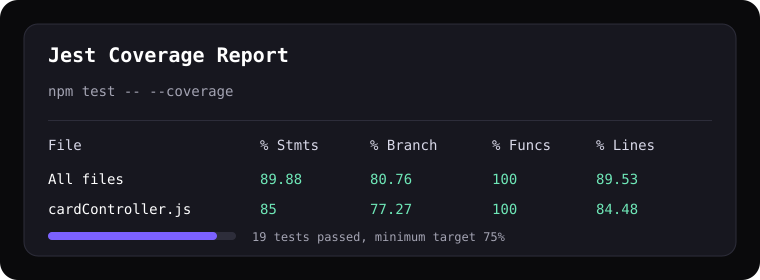

# Kantra Project - Regression Test Suite

[](https://github.com/Muhammadismail30/Kantra-project/actions/workflows/test.yml)

Repository ini berisi aplikasi Kantra, yaitu sistem kanban berbasis REST API. Regression test suite dibuat dengan Jest dan Supertest untuk menjaga endpoint CRUD agar tidak rusak karena perubahan kode yang tidak disengaja.

## Endpoint Yang Diuji

Tugas menggunakan contoh endpoint `/data`. Pada project ini endpoint CRUD yang tersedia secara nyata adalah API card, sehingga test suite diarahkan ke endpoint berikut:

- `GET /api/cards/column/:columnId` - ambil semua card pada column
- `POST /api/cards` - tambah card baru
- `PUT /api/cards/:id` - update card
- `DELETE /api/cards/:id` - hapus card

## Test Case

File utama regression test ada di:

```text
server/tests/cardRegression.test.js
```

Test suite mencakup minimal 10 skenario:

- GET berhasil mengambil semua card berdasarkan `column_id`
- GET mengembalikan array kosong ketika data tidak ada
- GET mengembalikan `500` ketika database gagal
- POST berhasil membuat card baru dengan input valid
- POST menolak `title` kosong
- POST menolak request tanpa token
- POST menolak token tidak valid
- POST tetap berhasil membuat card walaupun notifikasi gagal
- PUT berhasil update card
- PUT mengembalikan 404 jika card tidak ditemukan
- PUT menolak `priority` tidak valid
- DELETE berhasil menghapus card
- DELETE mengembalikan 404 jika card tidak ditemukan
- POST komentar berhasil menambahkan komentar pada card
- GET komentar berhasil mengambil komentar pada card

## Cara Menjalankan Test

Masuk ke folder backend:

```bash
cd server
```

Install dependency:

```bash
npm install
```

Jalankan test:

```bash
npm test
```

Jalankan test dengan coverage:

```bash
npm test -- --coverage
```

## Coverage

Target coverage minimal tugas adalah 75%. Setelah menjalankan perintah coverage, laporan HTML tersedia di:

```text
server/coverage/lcov-report/index.html
```

Hasil coverage terakhir:

```text
File                | % Stmts | % Branch | % Funcs | % Lines
--------------------|---------|----------|---------|--------
All files           |   89.88 |    80.76 |     100 |   89.53
cardController.js   |      85 |    77.27 |     100 |   84.48
auth.js             |     100 |      100 |     100 |     100
cardRoutes.js       |     100 |      100 |     100 |     100
```

Screenshot laporan coverage:



## Simulasi Regression

Contoh perubahan yang dapat menyebabkan regresi:

```js
body('priority').optional().isIn(['low', 'medium', 'high'])
```

Jika validasi tersebut diubah menjadi hanya menerima `high`, maka test berikut akan gagal:

```text
POST /api/cards - menambahkan card baru dengan input valid
PUT /api/cards/:id - mengupdate card yang ditemukan
```

Dengan begitu, test suite berhasil mendeteksi bahwa perubahan validasi merusak behavior API yang sebelumnya valid.

## GitHub Actions

Workflow CI tersedia di:

```text
.github/workflows/test.yml
```

Pipeline akan berjalan otomatis pada setiap `push` dan `pull_request` ke branch `main` atau `master`, lalu menjalankan:

```bash
npm ci
npm test -- --coverage
```

Badge akan aktif setelah workflow pertama berhasil berjalan di GitHub.
